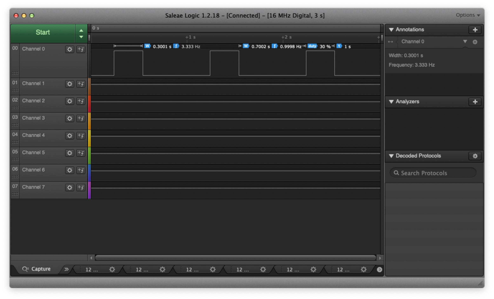
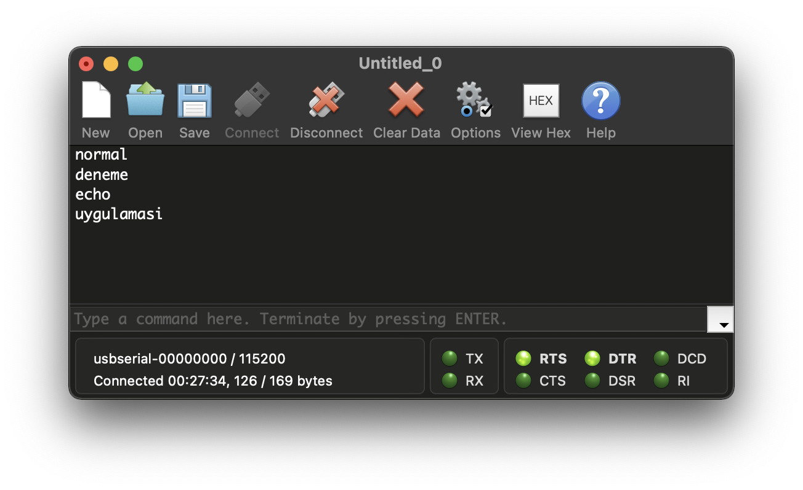
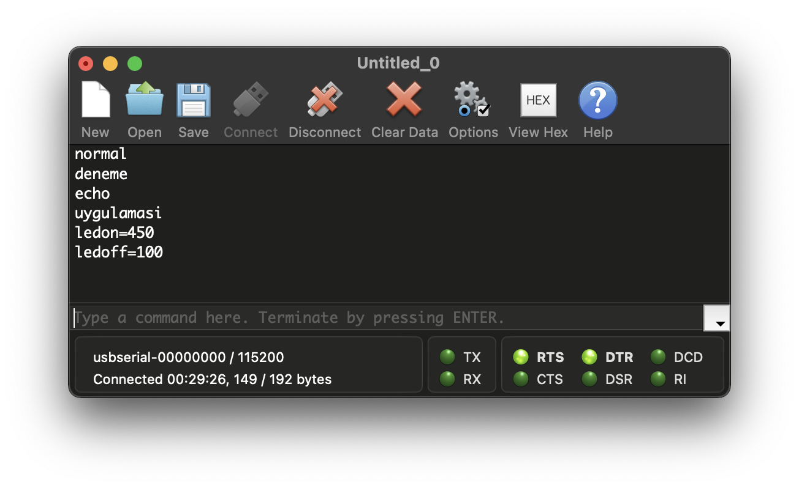
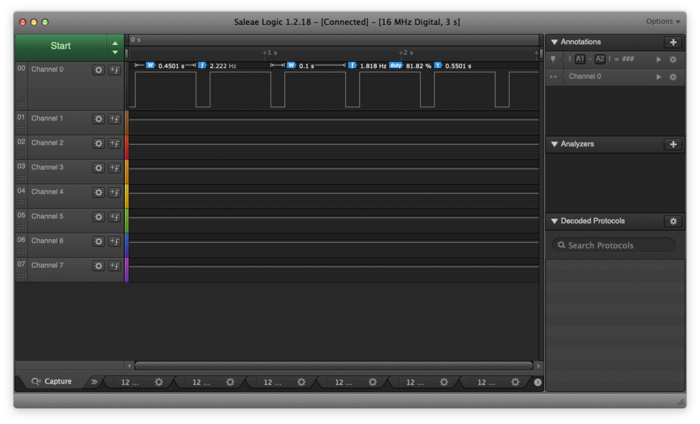
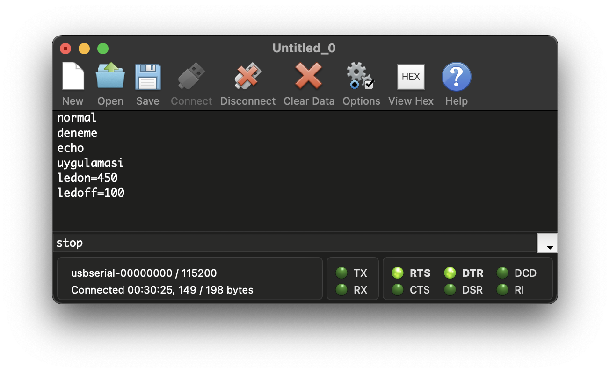
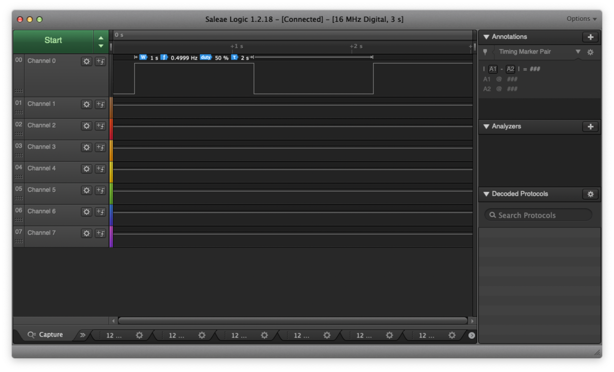
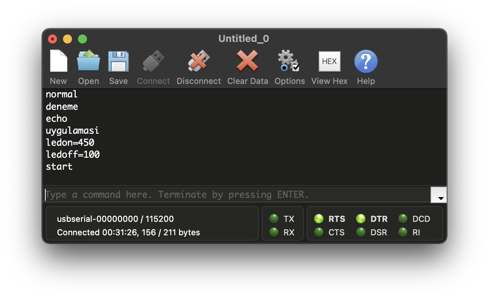
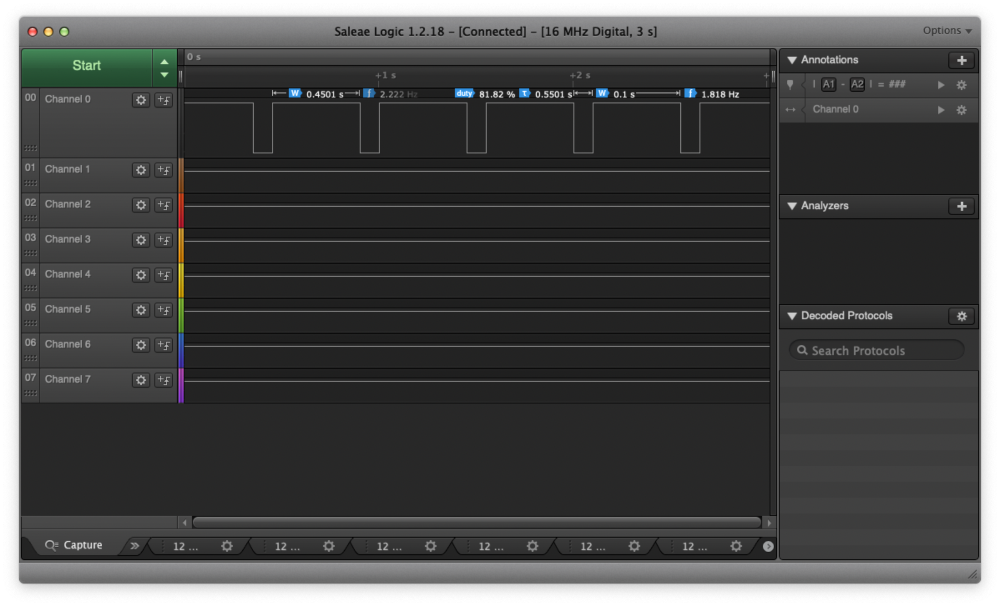

# AutonomsProject
 autonoms assessment study
 
## Project Output

Figure 1.1 | System first run, LED On: 700ms / LED Off Time: 300ms 

Figure 1.2 | System first run, UART Echo Output 

Figure 2.1 | Changing LED On and LED Off Time 

Figure 2.2 | Changing LED On and LED Off Time, LED On: 450ms / LED Off Time: 100ms 

Figure 3.1 | Sending the "stop" command, Echo Taks Terminates 

Figure 3.2 | After "stop" command, LED On: 1s / LED Off Time: 1s 

Figure 4.1 | Sending "start" command again 

Figure 4.2 | System works with previous led on and led off values, LED On: 450ms / LED Off Time: 100ms 

